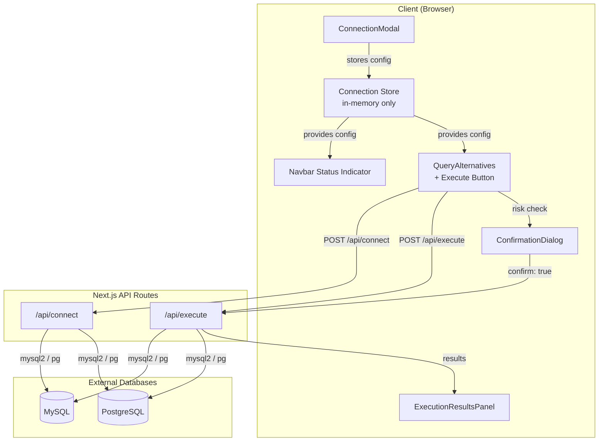
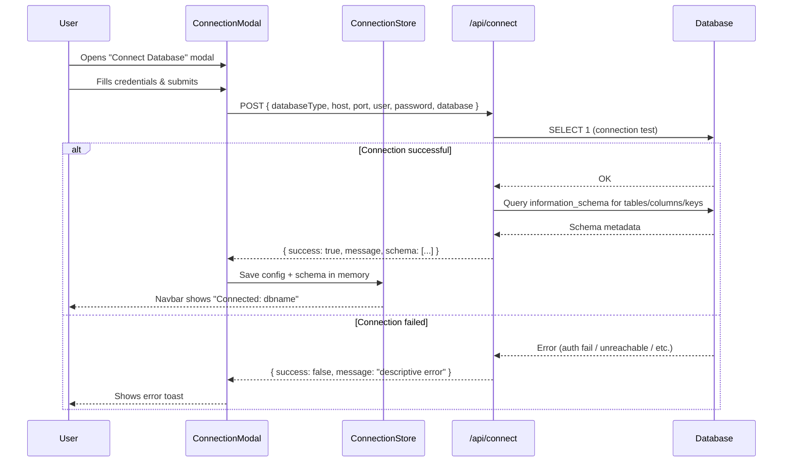
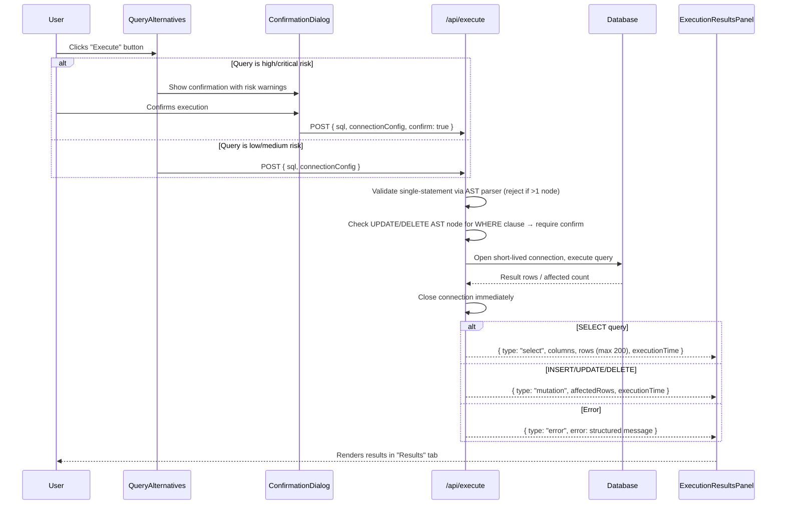

# Design Document: Database Connectivity

## Overview

This feature adds real database connectivity and query execution to the SQL Query Generator. Users will be able to connect to MySQL or PostgreSQL databases directly from the UI, inspect real schema metadata (tables, columns, keys), and execute generated queries against live databases — all within a single session with no server-side credential persistence.

The design prioritizes security (credentials exist only in memory for the request lifecycle), safety (stacked-query prevention, WHERE-clause guards for destructive operations), and seamless integration with the existing query generation and impact analysis flow. Two new API routes (`/api/connect` and `/api/execute`) handle backend operations, while new client components (`ConnectionModal`, `ExecutionResultsPanel`, connection status indicator) provide the user interface.

## Architecture



## Sequence Diagrams

### Connection Flow



### Query Execution Flow



## Components and Interfaces

### Component 1: ConnectionModal

**Purpose**: Modal dialog for entering database connection credentials.

```typescript
interface ConnectionModalProps {
  isOpen: boolean;
  onClose: () => void;
  onConnected: (schema: LiveTableInfo[]) => void;
}
```

**Responsibilities**:
- Renders form fields: databaseType (dropdown), host, port, user, password, database name
- Pre-fills port based on databaseType (3306 for MySQL, 5432 for PostgreSQL)
- Calls `/api/connect` on submit
- Displays loading state during connection test
- Shows error messages from failed connections via toast
- On success, passes schema to parent and updates connection store

### Component 2: ExecutionResultsPanel

**Purpose**: Displays query execution results (data table for SELECT, summary for mutations, errors).

```typescript
interface ExecutionResultsPanelProps {
  result: ExecutionResult | null;
}
```

**Responsibilities**:
- For SELECT: renders scrollable data table with column headers and row data (capped at 200 rows)
- For INSERT/UPDATE/DELETE: renders success message with affected row count and execution time
- For errors: renders formatted database error message
- Shows execution time badge
- Handles empty result sets gracefully

### Component 3: ConfirmationDialog

**Purpose**: Warns user before executing high/critical risk or unguarded destructive queries.

```typescript
interface ConfirmationDialogProps {
  isOpen: boolean;
  title: string;
  message: string;
  riskLevel: RiskLevel;
  warnings: string[];
  onConfirm: () => void;
  onCancel: () => void;
}
```

**Responsibilities**:
- Displays risk level with appropriate styling (amber for high, red for critical)
- Shows warning messages from impact analysis
- Requires explicit "Execute Anyway" action
- Provides clear "Cancel" option

### Component 4: ConnectionStatusIndicator

**Purpose**: Shows current connection state in the navbar.

```typescript
interface ConnectionStatusProps {
  // Reads from connection store directly
}
```

**Responsibilities**:
- Displays green dot + database name when connected
- Displays gray dot + "Disconnected" when not connected
- Clicking opens the ConnectionModal

## Data Models

### New Types (additions to types/index.ts)

```typescript
// Connection configuration — lives only in React state (memory)
interface ConnectionConfig {
  databaseType: DatabaseType;
  host: string;
  port: number;
  user: string;
  password: string;
  database: string;
}

// Schema info returned from /api/connect (richer than existing TableInfo)
interface LiveTableInfo {
  name: string;
  columns: LiveColumnInfo[];
}

interface LiveColumnInfo {
  name: string;
  type: string;
  isPrimary: boolean;
  isNullable: boolean;
  defaultValue: string | null;
  foreignKey: {
    referencedTable: string;
    referencedColumn: string;
  } | null;
}

// POST /api/connect request body
interface ConnectRequest {
  databaseType: DatabaseType;
  host: string;
  port: number;
  user: string;
  password: string;
  database: string;
}

// POST /api/connect response
interface ConnectResponse {
  success: boolean;
  message: string;
  schema?: LiveTableInfo[];
}

// POST /api/execute request body
interface ExecuteRequest {
  sql: string;
  connectionConfig: ConnectionConfig;
  confirm?: boolean; // Required for UPDATE/DELETE without WHERE
}

// POST /api/execute response
type ExecutionResult =
  | SelectResult
  | MutationResult
  | ExecutionError;

interface SelectResult {
  type: "select";
  columns: string[];
  rows: Record<string, unknown>[];
  rowCount: number;
  hasMore: boolean; // true when the database returned more than 200 rows (201st row detected)
  executionTimeMs: number;
}

interface MutationResult {
  type: "mutation";
  operation: "INSERT" | "UPDATE" | "DELETE";
  affectedRows: number;
  executionTimeMs: number;
}

interface ExecutionError {
  type: "error";
  code: string;
  message: string;
  detail?: string;
}
```

**Validation Rules**:
- `ConnectionConfig.host`: non-empty string
- `ConnectionConfig.port`: integer 1–65535
- `ConnectionConfig.user`: non-empty string
- `ConnectionConfig.password`: string (can be empty for some local setups)
- `ConnectionConfig.database`: non-empty string
- `ExecuteRequest.sql`: non-empty, single statement only (validated via AST parsing — `node-sql-parser` must produce exactly 1 statement node)
- `ExecuteRequest.confirm`: must be `true` if sql is UPDATE/DELETE without WHERE clause

## Key Functions with Formal Specifications

### Function 1: validateSingleStatement(sql)

```typescript
function validateSingleStatement(sql: string): { valid: boolean; error?: string }
```

**Preconditions:**
- `sql` is a non-empty trimmed string

**Postconditions:**
- Returns `{ valid: true }` if the parser produces exactly one AST statement node
- Returns `{ valid: false, error: "..." }` if the parser produces more than one statement node
- Correctly handles semicolons inside string literals (e.g., `WHERE name = 'O''Brien;'`), comments, and harmless trailing semicolons — because the AST parser resolves these structurally, not textually
- Does not mutate input

**Logic:**
- Use `node-sql-parser` (supports both MySQL and PostgreSQL dialects) to parse the input into an AST
- Check if `parser.astify(sql)` returns an array with length > 1
- If length > 1 → reject (multiple statements)
- If length === 1 → accept
- If parse throws a syntax error → accept (let the database return the real error; we only gate on multi-statement, not validity)

**Why AST over regex:** A naive split on `;` breaks on legitimate semicolons inside string literals (e.g., `WHERE notes = 'see rule 3; appendix'`) and on harmless trailing semicolons. The AST parser handles all of these correctly because it understands SQL grammar structure.

### Function 2: requiresConfirmation(sql)

```typescript
function requiresConfirmation(sql: string, databaseType: DatabaseType): boolean
```

**Preconditions:**
- `sql` is a non-empty trimmed string representing a single statement (already validated by `validateSingleStatement`)

**Postconditions:**
- If AST parse succeeds: returns `true` if the AST node type is `update` or `delete` AND the AST node's `where` property is `null`/`undefined`. Returns `false` otherwise.
- If AST parse fails AND `classifyStatementType(sql)` returns "DELETE" or "UPDATE": returns `true` (fail closed — require confirmation for unparseable destructive statements)
- If AST parse fails AND `classifyStatementType(sql)` returns anything else: returns `false` (fail open — non-destructive statements can't cause mass data loss)

**Logic:**
1. Call `classifyStatementType(sql)` to determine the effective DML type (handles comments, whitespace, CTEs)
2. Attempt AST parse via `node-sql-parser`
3. If parse succeeds: check `ast.type` and `ast.where` structurally
4. If parse fails: return `statementType === "DELETE" || statementType === "UPDATE"`

**Why AST over string search:** A text search for "WHERE" is fooled by:
- `WHERE` appearing inside a subquery in a SELECT list but not the outer DELETE
- `WHERE` inside a string literal: `DELETE FROM logs WHERE msg = 'check WHERE clause'` (would incorrectly pass)
- `WHERE` in a comment: `DELETE FROM logs /* WHERE id > 5 */`
The AST approach checks the structural presence of a WHERE clause on the actual statement node, immune to all these false positives/negatives.

**Why fail-closed on parse error:** `DELETE ... USING` is valid PostgreSQL but `node-sql-parser` can't parse it. Treating parse failure as "safe" would silently skip the confirmation dialog on a genuinely destructive query. The fail-closed approach may produce false-positive confirmations (e.g., `DELETE FROM a USING b WHERE ...`) but never skips a necessary one.

**classifyStatementType behavior:**
- Strips `/* ... */` block comments and `-- ...` line comments before keyword detection
- Case-insensitive (applies `toUpperCase()` before comparison)
- Handles CTE prefixes: walks past `WITH name AS (...)` parenthesized bodies by tracking paren depth, then reads the terminal DML keyword
- Example: `WITH x AS (SELECT ...) DELETE FROM ...` → returns "DELETE"
- Example: `/* comment */ DELETE FROM ...` → returns "DELETE"
- Example: `-- comment\nDELETE FROM ...` → returns "DELETE"

### Function 3: executeQuery(sql, config)

```typescript
async function executeQuery(
  sql: string,
  config: ConnectionConfig
): Promise<ExecutionResult>
```

**Preconditions:**
- `sql` passes `validateSingleStatement`
- `config` has all required fields populated
- If `requiresConfirmation(sql)` is true, the caller has already verified `confirm === true`

**Postconditions:**
- Opens a new database connection using `config`
- Executes the single SQL statement
- For SELECT: the row cap of 200 is enforced at the database level by wrapping the query (see Row Cap Strategy below) — the database never returns more than 201 rows to the server
- For INSERT/UPDATE/DELETE: returns affected row count and execution time
- Connection is closed in a `finally` block regardless of success or failure (guaranteed cleanup — see Connection Lifecycle below)
- On database error: returns structured `ExecutionError` (never throws unhandled)

**Row Cap Strategy (enforced at DB level, not JS slice):**
- For MySQL: wrap as `SELECT * FROM ({original_sql}) AS __subq LIMIT 201`
- For PostgreSQL: wrap as `SELECT * FROM ({original_sql}) AS __subq FETCH FIRST 201 ROWS ONLY`
- We fetch 201 rows so we can determine `hasMore`: if the database returns exactly 201 rows, `hasMore = true` and we trim the array to 200 before responding. The 201st row is never included in the client response — it is only used internally to compute the boolean.
- This prevents the database from materializing millions of rows into server memory

**Connection Lifecycle (finally-based cleanup):**
- Connection is created before the try block
- All query logic is inside a try block
- `connection.end()` is called in the `finally` block, guaranteeing cleanup even if an unexpected error occurs mid-execution

**Loop Invariants:** N/A

### Function 4: fetchLiveSchema(config)

```typescript
async function fetchLiveSchema(config: ConnectionConfig): Promise<LiveTableInfo[]>
```

**Preconditions:**
- Database connection has been verified (SELECT 1 succeeded)
- `config` has valid credentials

**Postconditions:**
- Returns array of all user tables with column metadata
- For MySQL: queries `information_schema.COLUMNS`, `information_schema.KEY_COLUMN_USAGE`, `information_schema.TABLE_CONSTRAINTS`
- For PostgreSQL: queries `information_schema.columns`, `pg_catalog.pg_constraint`, `information_schema.table_constraints`
- Each column includes: name, type, isPrimary, isNullable, defaultValue, foreignKey reference
- Returns empty array if database has no user tables
- Never exposes system tables

## Algorithmic Pseudocode

### Connection Test & Schema Fetch Algorithm

```typescript
async function handleConnect(req: ConnectRequest): Promise<ConnectResponse> {
  // Step 1: Validate input
  if (!req.host || !req.port || !req.user || !req.database) {
    return { success: false, message: "Missing required connection fields" };
  }

  // Step 2: Create ephemeral connection with guaranteed cleanup via finally
  let connection;
  try {
    connection = await createConnection(req);
  } catch (err: any) {
    return {
      success: false,
      message: classifyConnectionError(err),
    };
  }

  try {
    // Step 3: Test connectivity
    await connection.query("SELECT 1");

    // Step 4: Fetch schema metadata
    const schema = await fetchLiveSchema(req);
    return {
      success: true,
      message: `Connected to ${req.database}. Found ${schema.length} tables.`,
      schema,
    };
  } catch (err: any) {
    return { success: false, message: "Connection test failed: " + err.message };
  } finally {
    // GUARANTEED cleanup — always close regardless of success/failure path
    await connection.end().catch(() => {});
  }
}
```

### Query Execution Algorithm

**Order of Operations (critical invariant):** All validation (single-statement check, WHERE-clause guard) is performed on the ORIGINAL user SQL. The LIMIT/FETCH FIRST wrapping for row caps is applied AFTER validation passes, producing a separate `executableSql` string that is sent to the database. The user's original SQL is never mutated.

```typescript
async function handleExecute(req: ExecuteRequest): Promise<ExecutionResult> {
  // ──────────────────────────────────────────────────────────────────
  // PHASE 1: VALIDATION (operates on original user SQL — req.sql)
  // ──────────────────────────────────────────────────────────────────

  // Step 1: Validate single statement using AST parser (on ORIGINAL sql)
  const validation = validateSingleStatement(req.sql);
  if (!validation.valid) {
    return { type: "error", code: "MULTI_STATEMENT", message: validation.error! };
  }

  // Step 2: Check WHERE clause guard using AST (on ORIGINAL sql)
  if (requiresConfirmation(req.sql) && req.confirm !== true) {
    return {
      type: "error",
      code: "CONFIRMATION_REQUIRED",
      message: "This UPDATE/DELETE has no WHERE clause. Set confirm: true to proceed.",
    };
  }

  // Step 3: Determine query type from AST (on ORIGINAL sql)
  const operationType = detectOperation(req.sql); // uses AST node.type

  // ──────────────────────────────────────────────────────────────────
  // PHASE 2: WRAPPING (produces executableSql for DB — only for SELECT)
  // ──────────────────────────────────────────────────────────────────

  // Step 4: If SELECT, wrap with DB-level row cap (creates NEW string)
  let executableSql = req.sql;
  if (operationType === "SELECT") {
    if (req.connectionConfig.databaseType === "mysql") {
      executableSql = `SELECT * FROM (${req.sql}) AS __subq LIMIT 201`;
    } else {
      executableSql = `SELECT * FROM (${req.sql}) AS __subq FETCH FIRST 201 ROWS ONLY`;
    }
  }

  // ──────────────────────────────────────────────────────────────────
  // PHASE 3: EXECUTION (uses executableSql against the database)
  // ──────────────────────────────────────────────────────────────────

  // Step 5: Execute with guaranteed connection cleanup via finally
  let connection;
  try {
    connection = await createConnection(req.connectionConfig);
    const startTime = performance.now();
    const result = await connection.query(executableSql);
    const executionTimeMs = Math.round(performance.now() - startTime);

    // Step 6: Format response based on operation type
    if (operationType === "SELECT") {
      const allRows = Array.isArray(result) ? result : [];
      const hasMore = allRows.length > 200;
      const rows = allRows.slice(0, 200); // trim to 200 — 201st row never leaves the server
      const columns = rows.length > 0 ? Object.keys(rows[0]) : [];
      return {
        type: "select",
        columns,
        rows,
        rowCount: rows.length,
        hasMore, // true if DB returned 201 rows (more data exists)
        executionTimeMs,
      };
    } else {
      return {
        type: "mutation",
        operation: operationType as "INSERT" | "UPDATE" | "DELETE",
        affectedRows: result.affectedRows ?? result.rowCount ?? 0,
        executionTimeMs,
      };
    }
  } catch (err: any) {
    return {
      type: "error",
      code: err.code ?? "QUERY_ERROR",
      message: err.message ?? "Query execution failed",
      detail: err.detail ?? undefined,
    };
  } finally {
    // GUARANTEED cleanup — connection is always closed regardless of success/failure
    if (connection) {
      await connection.end().catch(() => {});
    }
  }
}
```

### Single Statement Validation Algorithm (AST-based)

```typescript
import { Parser } from "node-sql-parser";

function validateSingleStatement(
  sql: string,
  databaseType: DatabaseType
): { valid: boolean; error?: string } {
  const parser = new Parser();
  const dialect = databaseType === "mysql" ? "MySQL" : "PostgresQL";

  let ast;
  try {
    ast = parser.astify(sql, { database: dialect });
  } catch (parseError) {
    // If the parser can't parse it, we let it through — the database
    // will return the real syntax error. Our job here is ONLY to block
    // multi-statement input, not to validate SQL syntax.
    return { valid: true };
  }

  // parser.astify returns a single AST node for one statement,
  // or an array of AST nodes for multiple statements
  const statements = Array.isArray(ast) ? ast : [ast];

  if (statements.length > 1) {
    return {
      valid: false,
      error:
        "Multiple statements detected. Only one statement per execution is allowed " +
        "to prevent stacked-query injection.",
    };
  }

  return { valid: true };
}
```

**Key behaviors:**
- `SELECT * FROM users WHERE name = 'O''Brien;'` → parses as 1 AST node → `{ valid: true }` ✓
- `SELECT 1;` (trailing semicolon) → parses as 1 AST node → `{ valid: true }` ✓
- `SELECT 1; DROP TABLE users` → parses as 2 AST nodes → `{ valid: false }` ✓
- Unparseable SQL (e.g., vendor-specific syntax) → parse fails → `{ valid: true }` (let DB error)

### WHERE Clause Guard Algorithm (AST-based, fail-closed for destructive statements)

```typescript
/**
 * Classifies the effective operation type of a SQL statement by extracting
 * the first meaningful DML keyword, handling:
 * - Leading whitespace
 * - Block comments (/* ... */)
 * - Line comments (-- ...)
 * - CTE prefixes (WITH ... AS (...) <DML>)
 *
 * This runs BEFORE the AST parse attempt, so it's available in both the
 * success and failure paths.
 */
function classifyStatementType(sql: string): "UPDATE" | "DELETE" | "SELECT" | "INSERT" | "OTHER" {
  // Step 1: Strip all comments (block and line) and leading whitespace
  const stripped = sql
    .replace(/\/\*[\s\S]*?\*\//g, "")   // remove block comments
    .replace(/--[^\n]*/g, "")             // remove line comments
    .trimStart();

  // Step 2: Normalize to uppercase for case-insensitive matching
  const upper = stripped.toUpperCase();

  // Step 3: Check for CTE prefix — WITH ... AS (...) <actual DML keyword>
  // If statement starts with WITH, we need to find the DML keyword after the CTE(s)
  if (upper.startsWith("WITH")) {
    // Walk past all CTE definitions to find the terminal DML keyword.
    // CTEs have the shape: WITH name AS (subquery) [, name AS (subquery)]* <DML>
    // We track parenthesis depth to skip past the CTE subqueries.
    let i = 4; // skip "WITH"
    let depth = 0;
    let foundClosingParen = false;

    while (i < stripped.length) {
      const ch = stripped[i];
      if (ch === "(") {
        depth++;
        foundClosingParen = false;
      } else if (ch === ")") {
        depth--;
        if (depth === 0) foundClosingParen = true;
      } else if (depth === 0 && foundClosingParen) {
        // We're outside all CTE parentheses — look for the DML keyword
        const remainder = stripped.slice(i).trimStart().toUpperCase();
        if (remainder.startsWith(",")) {
          // Another CTE follows — continue scanning
          foundClosingParen = false;
          i++;
          continue;
        }
        if (remainder.startsWith("DELETE")) return "DELETE";
        if (remainder.startsWith("UPDATE")) return "UPDATE";
        if (remainder.startsWith("SELECT")) return "SELECT";
        if (remainder.startsWith("INSERT")) return "INSERT";
        return "OTHER";
      }
      i++;
    }
    // Malformed CTE — can't determine, treat as OTHER
    return "OTHER";
  }

  // Step 4: No CTE — check the first keyword directly
  if (upper.startsWith("DELETE")) return "DELETE";
  if (upper.startsWith("UPDATE")) return "UPDATE";
  if (upper.startsWith("SELECT")) return "SELECT";
  if (upper.startsWith("INSERT")) return "INSERT";
  return "OTHER";
}

function requiresConfirmation(
  sql: string,
  databaseType: DatabaseType
): boolean {
  const parser = new Parser();
  const dialect = databaseType === "mysql" ? "MySQL" : "PostgresQL";

  // Step 1: Classify the statement type BEFORE attempting parse.
  // This is available in both success and failure paths.
  const statementType = classifyStatementType(sql);

  // Step 2: Attempt AST parse
  let ast;
  try {
    ast = parser.astify(sql, { database: dialect });
  } catch {
    // ─── PARSE FAILURE PATH ───────────────────────────────────────
    // Apply fail-closed for destructive statements, fail-open for others.
    //
    // - UPDATE/DELETE that fails to parse → return TRUE (require confirmation)
    //   Rationale: may be valid vendor-specific syntax (e.g., PG DELETE ... USING)
    //   that the parser doesn't support. Better to show an unnecessary dialog
    //   than to silently skip confirmation on a destructive query.
    //
    // - SELECT/INSERT/OTHER that fails to parse → return FALSE (no confirmation)
    //   Rationale: these cannot cause mass data loss. Let the DB return the
    //   real syntax error if the SQL is truly invalid.
    // ──────────────────────────────────────────────────────────────
    return statementType === "DELETE" || statementType === "UPDATE";
  }

  // Step 3: AST parse succeeded — inspect the node structurally
  const node = Array.isArray(ast) ? ast[0] : ast;

  // Only gate UPDATE and DELETE operations
  if (node.type !== "update" && node.type !== "delete") {
    return false;
  }

  // Check if the AST node has a WHERE clause
  // node.where is null/undefined when no WHERE is present
  return node.where == null;
}
```

**Design choices:**
1. `classifyStatementType` runs BEFORE the parse attempt, not inside the catch. This means the classification logic is tested and available regardless of parse outcome.
2. Comment stripping uses the same regex patterns as elsewhere — block comments `/* ... */` and line comments `-- ...` are both removed before keyword detection.
3. CTE handling: walks past parenthesized CTE bodies by tracking paren depth, then reads the DML keyword that follows. This correctly classifies `WITH x AS (...) DELETE FROM ...` as DELETE.
4. Case-insensitive: `toUpperCase()` is applied before all keyword comparisons.

**Key behaviors — fail-closed for unparseable destructive statements:**
- `DELETE FROM a USING b WHERE a.id = b.aid` → parse fails, classified as DELETE → returns `true` ✓
- `DELETE FROM a USING b` → parse fails, classified as DELETE → returns `true` ✓
- `UPDATE ... <vendor-specific syntax>` → parse fails, classified as UPDATE → returns `true` ✓
- `WITH cte AS (SELECT ...) DELETE FROM a USING b` → parse fails, classified as DELETE → returns `true` ✓

**Key behaviors — fail-open for unparseable non-destructive statements:**
- `SELECT <vendor-specific syntax>` → parse fails, classified as SELECT → returns `false` ✓
- `INSERT INTO ... <vendor-specific syntax>` → parse fails, classified as INSERT → returns `false` ✓
- `WITH cte AS (SELECT ...) SELECT ...` → parse fails, classified as SELECT → returns `false` ✓

**Key behaviors — normal AST path (parse succeeds):**
- `DELETE FROM users` → AST: type=delete, where=null → returns `true` ✓
- `DELETE FROM users WHERE id = 5` → AST: type=delete, where={...} → returns `false` ✓
- `DELETE FROM logs WHERE msg = 'check WHERE clause'` → AST correctly finds WHERE node → returns `false` ✓
- `UPDATE users SET active = 0 /* WHERE id = 1 */` → comment stripped by parser, no WHERE in AST → returns `true` ✓
- `SELECT * FROM users` → type=select → returns `false` ✓
- `WITH cte AS (SELECT 1) DELETE FROM users` → AST: type=delete, where=null → returns `true` ✓
- `WITH cte AS (SELECT 1) DELETE FROM users WHERE id IN (SELECT id FROM cte)` → AST: type=delete, where={...} → returns `false` ✓

**Dialect-specific behaviors (empirically verified with node-sql-parser v5.4.0):**

| SQL Pattern | Dialect | Result | requiresConfirmation |
|---|---|---|---|
| `DELETE FROM a WHERE a.id = 1` | MySQL / PG | AST: where={...} | `false` ✓ |
| `DELETE FROM a` | MySQL / PG | AST: where=null | `true` ✓ |
| `DELETE a FROM a JOIN b ON a.id = b.aid WHERE b.status = 1` | MySQL | AST: where={...} | `false` ✓ |
| `DELETE a FROM a JOIN b ON a.id = b.aid` | MySQL | AST: where=null | `true` ✓ |
| `UPDATE a JOIN b ON a.id = b.aid SET a.name = b.name` | MySQL | AST: where=null | `true` ✓ |
| `UPDATE a SET a.name = b.name FROM a JOIN b ON ... WHERE b.status = 1` | PostgreSQL | AST: where={...} | `false` ✓ |
| `UPDATE a SET a.name = b.name FROM a JOIN b ON a.id = b.aid` | PostgreSQL | AST: where=null | `true` ✓ |
| `DELETE FROM a WHERE EXISTS (SELECT 1 FROM b WHERE a.id = b.aid)` | PostgreSQL | AST: where={...} | `false` ✓ |
| `DELETE FROM a USING b WHERE a.id = b.aid` | PostgreSQL | PARSE ERROR → fail closed | `true` ✓ |
| `DELETE FROM a USING b` | PostgreSQL | PARSE ERROR → fail closed | `true` ✓ |
| `WITH x AS (...) DELETE FROM a USING b` | PostgreSQL | PARSE ERROR → fail closed | `true` ✓ |

**Known limitation — PostgreSQL `DELETE ... USING` syntax:**
`node-sql-parser` v5.4.0 does not support the PostgreSQL-specific `DELETE ... USING` join syntax. Because of the fail-closed design, any `DELETE ... USING` statement (with or without WHERE) will trigger the confirmation dialog. This means:
- `DELETE FROM a USING b WHERE a.id = b.aid` will show an unnecessary confirmation (false positive) — acceptable tradeoff.
- `DELETE FROM a USING b` (genuinely dangerous, no WHERE) will correctly require confirmation — the safety feature is never bypassed.

The standard PostgreSQL alternatives (`WHERE EXISTS`, `WHERE IN`, `UPDATE ... FROM ... WHERE`) all parse correctly and get precise AST-based WHERE detection without false positives.

## State Management Additions

### Connection Store (Separate Zustand store — NO persist)

```typescript
// lib/connectionStore.ts
import { create } from "zustand";
// NOTE: No persist middleware — credentials stay in memory only

interface ConnectionState {
  // Connection config (in-memory only, cleared on refresh)
  connectionConfig: ConnectionConfig | null;
  isConnected: boolean;
  databaseName: string | null;

  // Live schema from real database
  liveSchema: LiveTableInfo[];

  // Execution state
  lastExecutionResult: ExecutionResult | null;
  isExecuting: boolean;

  // Actions
  setConnection: (config: ConnectionConfig, schema: LiveTableInfo[]) => void;
  disconnect: () => void;
  setExecutionResult: (result: ExecutionResult | null) => void;
  setIsExecuting: (executing: boolean) => void;
}

export const useConnectionStore = create<ConnectionState>((set) => ({
  connectionConfig: null,
  isConnected: false,
  databaseName: null,
  liveSchema: [],
  lastExecutionResult: null,
  isExecuting: false,

  setConnection: (config, schema) =>
    set({
      connectionConfig: config,
      isConnected: true,
      databaseName: config.database,
      liveSchema: schema,
    }),

  disconnect: () =>
    set({
      connectionConfig: null,
      isConnected: false,
      databaseName: null,
      liveSchema: [],
      lastExecutionResult: null,
    }),

  setExecutionResult: (result) => set({ lastExecutionResult: result }),
  setIsExecuting: (executing) => set({ isExecuting: executing }),
}));
```

**Key design decision**: Using a separate Zustand store WITHOUT `persist` middleware ensures credentials are never written to `localStorage`. Page refresh = disconnect. This is intentional and documented.

## Example Usage

### Connecting to a Database

```typescript
// In ConnectionModal.tsx
const handleSubmit = async (formData: ConnectionConfig) => {
  setLoading(true);
  try {
    const res = await fetch("/api/connect", {
      method: "POST",
      headers: { "Content-Type": "application/json" },
      body: JSON.stringify(formData),
    });
    const data: ConnectResponse = await res.json();

    if (data.success && data.schema) {
      useConnectionStore.getState().setConnection(formData, data.schema);
      toast.success(data.message);
      onClose();
    } else {
      toast.error(data.message);
    }
  } catch (err) {
    toast.error("Failed to connect: network error");
  } finally {
    setLoading(false);
  }
};
```

### Executing a Query

```typescript
// In QueryAlternatives.tsx — Execute button handler
// STATE: pendingExecuteAlt holds the query awaiting confirmation (null = no pending)
const [pendingExecuteAlt, setPendingExecuteAlt] = useState<QueryAlternative | null>(null);
const [showConfirmDialog, setShowConfirmDialog] = useState(false);

const handleExecuteClick = (alt: QueryAlternative) => {
  const { connectionConfig } = useConnectionStore.getState();
  if (!connectionConfig) return; // button should be disabled, but guard anyway

  const impact = result.impact; // from parent GeneratedQueryResult

  // If high/critical risk → show confirmation dialog, do NOT send request yet
  if (impact.riskLevel === "high" || impact.riskLevel === "critical") {
    setPendingExecuteAlt(alt);       // remember which query
    setShowConfirmDialog(true);       // show dialog
    return;                           // ← STOP HERE. No fetch call. No confirm flag.
  }

  // Low/medium risk → execute immediately WITHOUT confirm flag
  executeQueryRequest(alt.sql, false);
};

// ONLY called when user clicks "Execute Anyway" in ConfirmationDialog
const handleConfirmExecute = () => {
  setShowConfirmDialog(false);
  if (pendingExecuteAlt) {
    executeQueryRequest(pendingExecuteAlt.sql, true); // ← confirm:true ONLY here
    setPendingExecuteAlt(null);
  }
};

// Shared fetch logic
const executeQueryRequest = async (sql: string, confirm: boolean) => {
  const { connectionConfig, setExecutionResult, setIsExecuting } = useConnectionStore.getState();
  if (!connectionConfig) return;

  setIsExecuting(true);
  try {
    const res = await fetch("/api/execute", {
      method: "POST",
      headers: { "Content-Type": "application/json" },
      body: JSON.stringify({
        sql,
        connectionConfig,
        // confirm is ONLY true when explicitly passed from handleConfirmExecute
        // It is NEVER a default value — the parameter is omitted entirely for safe queries
        ...(confirm ? { confirm: true } : {}),
      }),
    });
    const data: ExecutionResult = await res.json();
    setExecutionResult(data);
    // Switch to Results tab
  } catch (err) {
    setExecutionResult({
      type: "error",
      code: "NETWORK_ERROR",
      message: "Failed to reach the server",
    });
  } finally {
    setIsExecuting(false);
  }
};

// ConfirmationDialog wiring:
// <ConfirmationDialog
//   isOpen={showConfirmDialog}
//   onConfirm={handleConfirmExecute}   ← the ONLY path that sets confirm:true
//   onCancel={() => { setShowConfirmDialog(false); setPendingExecuteAlt(null); }}
//   ...
// />
```

**confirm:true sequence — step by step:**
1. User clicks "Execute" button → `handleExecuteClick(alt)` fires
2. If risk is high/critical → stores the query in `pendingExecuteAlt` state, shows `ConfirmationDialog`, and **returns without making any API call**
3. User sees the dialog with risk warnings. Two paths:
   a. **User clicks "Cancel"** → dialog closes, `pendingExecuteAlt` is cleared, no API call ever made
   b. **User clicks "Execute Anyway"** → `handleConfirmExecute()` fires → calls `executeQueryRequest(sql, true)` → the fetch body includes `{ confirm: true }`
4. For low/medium risk queries, `executeQueryRequest(sql, false)` is called directly, and the request body **omits** the `confirm` field entirely (it is never set to `false` — it's simply absent)

**Key guarantee:** The `confirm: true` flag can only be set as a direct result of the user clicking the "Execute Anyway" button in the ConfirmationDialog. There is no code path that defaults it to `true`.

### Rendering Execution Results

```typescript
// In ExecutionResultsPanel.tsx
function ExecutionResultsPanel({ result }: { result: ExecutionResult | null }) {
  if (!result) return <EmptyExecutionState />;

  switch (result.type) {
    case "select":
      return (
        <div>
          <ResultMetaBadge time={result.executionTimeMs} rows={result.rowCount} />
          <ScrollableDataTable columns={result.columns} rows={result.rows} />
          {result.hasMore && (
            <TruncationNotice shown={200} />
          )}
        </div>
      );
    case "mutation":
      return (
        <MutationSuccess
          operation={result.operation}
          affectedRows={result.affectedRows}
          executionTimeMs={result.executionTimeMs}
        />
      );
    case "error":
      return <ExecutionErrorDisplay code={result.code} message={result.message} detail={result.detail} />;
  }
}
```

## Correctness Properties

*A property is a characteristic or behavior that should hold true across all valid executions of a system — essentially, a formal statement about what the system should do. Properties serve as the bridge between human-readable specifications and machine-verifiable correctness guarantees.*

### Property 1: Connection Cleanup

*For any* API request to /api/connect or /api/execute that opens a database connection, the connection MUST be closed (via connection.end() in a finally block) before the response is returned, regardless of whether the operation succeeds or throws any category of error.

**Validates: Requirements 1.4, 6.4**

### Property 2: Input Validation Rejects Incomplete Connection Configs

*For any* ConnectRequest object where one or more required fields (host, port, user, database) are missing or empty, the Connection_API SHALL return a failure response without attempting a database connection.

**Validates: Requirement 1.2**

### Property 3: Multi-Statement Rejection

*For any* SQL input that produces more than one AST statement node when parsed by node-sql-parser, validateSingleStatement SHALL return { valid: false } and the Execution_API SHALL reject the request with error code MULTI_STATEMENT.

**Validates: Requirement 3.1**

### Property 4: Single Statements With Embedded Semicolons Pass Validation

*For any* syntactically valid single SQL statement that contains semicolons only inside string literals, inside comments, or as a trailing character, validateSingleStatement SHALL return { valid: true } because the AST parser resolves these structurally.

**Validates: Requirement 3.2**

### Property 5: WHERE Clause Guard

*For any* UPDATE or DELETE statement that the AST parser successfully parses, requiresConfirmation SHALL return true if and only if the AST node's where property is null/undefined. If a WHERE clause is structurally present in the AST, requiresConfirmation SHALL return false.

**Validates: Requirements 4.1, 4.2**

### Property 6: Fail-Closed for Unparseable Destructive, Fail-Open for Non-Destructive

*For any* SQL string where node-sql-parser throws a parse error: if classifyStatementType identifies the string as UPDATE or DELETE, requiresConfirmation SHALL return true (fail-closed). If classifyStatementType identifies the string as SELECT, INSERT, or OTHER, requiresConfirmation SHALL return false (fail-open).

**Validates: Requirements 4.3, 4.4**

### Property 7: classifyStatementType Correctness Through Comments and CTEs

*For any* SQL string of the form `[comments] [WITH name AS (subquery) [, ...]] <DML_KEYWORD> ...`, classifyStatementType SHALL return the DML keyword type (DELETE, UPDATE, SELECT, INSERT) regardless of leading block/line comments, whitespace, case variation, or CTE prefix depth.

**Validates: Requirement 4.5**

### Property 8: Row Cap Wrapping by Dialect

*For any* SELECT query, the Execution_API SHALL wrap the original SQL in a subquery appending `LIMIT 201` for MySQL databases or `FETCH FIRST 201 ROWS ONLY` for PostgreSQL databases, ensuring the database never materializes more than 201 rows.

**Validates: Requirements 5.1, 5.2**

### Property 9: Response Row Cap

*For any* SELECT execution result containing N rows from the database (where N may be 0 to 201), the API response SHALL contain at most 200 rows and SHALL set `hasMore` to true if and only if the database returned exactly 201 rows. The 201st row SHALL never be included in the response payload — it is used only to compute the `hasMore` boolean.

**Validates: Requirement 5.3**

### Property 10: Structured Error Responses

*For any* database error (authentication failure, network timeout, syntax error, permission denial, or any other error category) thrown during query execution, the Execution_API SHALL catch it and return a structured JSON response with type "error", code, and message fields — never throwing an unhandled exception.

**Validates: Requirements 6.3, 6.5**

## Error Handling

### Error Scenario 1: Authentication Failure

**Condition**: Invalid username/password or insufficient privileges
**Response**: `{ success: false, message: "Authentication failed: Access denied for user 'x'@'host'" }`
**Recovery**: User corrects credentials in the modal and retries

### Error Scenario 2: Unreachable Host

**Condition**: Host doesn't exist, port is closed, or firewall blocks
**Response**: `{ success: false, message: "Connection failed: Unable to reach host:port. Check that the database server is running and accessible." }`
**Recovery**: User verifies host/port configuration

### Error Scenario 3: Multiple Statements Detected

**Condition**: SQL input contains stacked queries (e.g., `SELECT 1; DROP TABLE users`)
**Response**: HTTP 400, `{ type: "error", code: "MULTI_STATEMENT", message: "..." }`
**Recovery**: User submits only a single statement

### Error Scenario 4: Unguarded Destructive Operation

**Condition**: UPDATE/DELETE without WHERE and `confirm` not set
**Response**: HTTP 400, `{ type: "error", code: "CONFIRMATION_REQUIRED", message: "This UPDATE/DELETE has no WHERE clause..." }`
**Recovery**: Client shows confirmation dialog, resends with `confirm: true`

### Error Scenario 5: Query Syntax Error

**Condition**: SQL has invalid syntax for the target database
**Response**: `{ type: "error", code: "ER_PARSE_ERROR" / "42601", message: database-provided error text }`
**Recovery**: User fixes the query

### Error Scenario 6: Connection Timeout During Execution

**Condition**: Query takes too long or connection drops mid-execution
**Response**: `{ type: "error", code: "ETIMEDOUT", message: "Query execution timed out" }`
**Recovery**: User can retry with a simpler query or check database load

## Testing Strategy

### Unit Testing Approach

- `validateSingleStatement`: Test AST parsing with single statements, multiple statements, semicolons inside string literals (e.g., `WHERE name = 'O''Brien;'`), comments containing semicolons, trailing semicolons, CTEs, vendor-specific syntax that fails to parse (should pass through)
- `requiresConfirmation`: Test UPDATE/DELETE with and without WHERE in the AST, case variations, CTEs before DELETE, WHERE inside subqueries but not on the outer statement, WHERE inside string literals/comments. Also test fail-closed behavior: unparseable DELETE/UPDATE (e.g., `DELETE ... USING`) must return `true`; unparseable SELECT/INSERT must return `false`
- `classifyStatementType`: Test with leading whitespace, block comments, line comments, CTE prefixes (`WITH ... AS (...) DELETE`), nested CTEs, case variations, garbage input
- `classifyConnectionError`: Map error codes to user-friendly messages
- `detectOperation`: Correctly identify operation from AST node.type with leading whitespace, comments, CTEs

### Property-Based Testing Approach

**Property Test Library**: fast-check

- **Single Statement Property**: For any randomly generated valid single SQL statement, `validateSingleStatement` returns `{ valid: true }` (generate statements using known templates)
- **Multi Statement Property**: For any concatenation of two valid SQL statements joined by `;\n`, `validateSingleStatement` returns `{ valid: false }`
- **Semicolons In Strings Property**: For any SQL containing `;` only inside quoted string literals, `validateSingleStatement` returns `{ valid: true }`
- **Row Cap Property**: For any mocked SELECT query against a table with N rows (N > 200), the executed SQL always contains `LIMIT 201` or `FETCH FIRST 201 ROWS ONLY`, and the response has at most 200 rows
- **Connection Cleanup Property**: For any sequence of execute calls (success or failure), connection count after all calls complete is 0 (verified via spy on `.end()`)
- **WHERE Guard Property**: For any randomly generated UPDATE/DELETE without a WHERE clause, `requiresConfirmation` returns `true`. For any such statement with a WHERE clause, returns `false`
- **Fail-Closed Property**: For any string S where `classifyStatementType(S)` returns "DELETE" or "UPDATE", if `node-sql-parser` throws on S, then `requiresConfirmation(S)` returns `true`
- **Fail-Open Property**: For any string S where `classifyStatementType(S)` returns "SELECT" or "INSERT", if `node-sql-parser` throws on S, then `requiresConfirmation(S)` returns `false`
- **CTE Classification Property**: For any string of the form `WITH <name> AS (<subquery>) <DML> ...`, `classifyStatementType` returns the type of `<DML>` (not "OTHER" or the CTE keyword)

### Integration Testing Approach

- Test `/api/connect` with a real test database (MySQL and PostgreSQL via Docker)
- Test `/api/execute` SELECT returns correct columns and capped rows
- Test `/api/execute` INSERT returns affected row count
- Test rejection of multi-statement input
- Test WHERE clause guard triggers correctly
- Test that errors from invalid credentials don't crash the route

## Performance Considerations

- **Short-lived connections**: Each API call opens and closes a connection. For frequent execution, this adds ~20-50ms overhead per call. Acceptable for an interactive tool; if usage patterns demand it, a future iteration could use connection pooling with session affinity.
- **Row cap at 200**: Enforced at the database level by wrapping SELECT queries in a subquery with `LIMIT 201` (MySQL) or `FETCH FIRST 201 ROWS ONLY` (PostgreSQL). The database never materializes more than 201 rows. We fetch 201 so we can detect "there's more" — but only 200 are returned to the client. This prevents memory exhaustion on genuinely large tables.
- **No streaming**: Results are fully buffered before responding. For the 200-row cap this is fine (~100KB max payload for typical rows).
- **Schema fetch**: Reading `information_schema` can be slow on databases with hundreds of tables. Consider caching the schema in the connection store (already done — only fetched on connect).

## Security Considerations

1. **Credentials in transit only**: The password is sent over HTTPS in the POST body and exists only in the request handler's stack frame. No logging, no session storage, no database writes.
2. **Stacked-query injection prevention**: `validateSingleStatement` uses `node-sql-parser` to produce an AST. If parsing yields more than one statement node, the request is rejected. This is immune to semicolons inside string literals, comments, or quoted identifiers — unlike a regex/split approach.
3. **WHERE clause safety net**: `requiresConfirmation` inspects the AST node's `.where` property structurally. A text search for "WHERE" would be fooled by subqueries, string literals, or comments containing the word — the AST approach checks the actual clause on the target statement.
4. **No server-side pooling with cached credentials**: Each request creates a fresh connection from the request body. No credentials are retained between requests.
5. **Error message sanitization**: Database errors are returned to the client as-is (they own the database), but connection strings and passwords are never included in error responses.
6. **Rate limiting note**: The README will document that this tool should NOT be exposed to untrusted users without per-user auth and rate limiting. In its current form, it's designed for local development or trusted environments.

## Dependencies

| Package | Version | Purpose |
|---------|---------|---------|
| `mysql2` | `^3.11.0` | MySQL connection and query execution (Promise API) |
| `pg` | `^8.12.0` | PostgreSQL connection and query execution |
| `node-sql-parser` | `^5.4.0` | AST-based SQL parsing for single-statement validation and WHERE clause detection |
| `@types/pg` | `^8.11.0` | TypeScript types for pg (devDependency) |

Both database libraries support:
- Promise-based APIs
- Connection configuration via object
- Proper connection cleanup (`.end()`)
- Parameterized queries (not needed here since we execute user-authored SQL, but available)
- Error objects with code/message properties for structured error handling

`node-sql-parser` supports:
- MySQL and PostgreSQL dialect parsing
- Returns AST with typed nodes (select, update, delete, insert, etc.)
- Each node exposes `.where`, `.from`, `.columns` etc. for structural inspection
- Handles string literals, comments, and quoted identifiers correctly in the grammar
