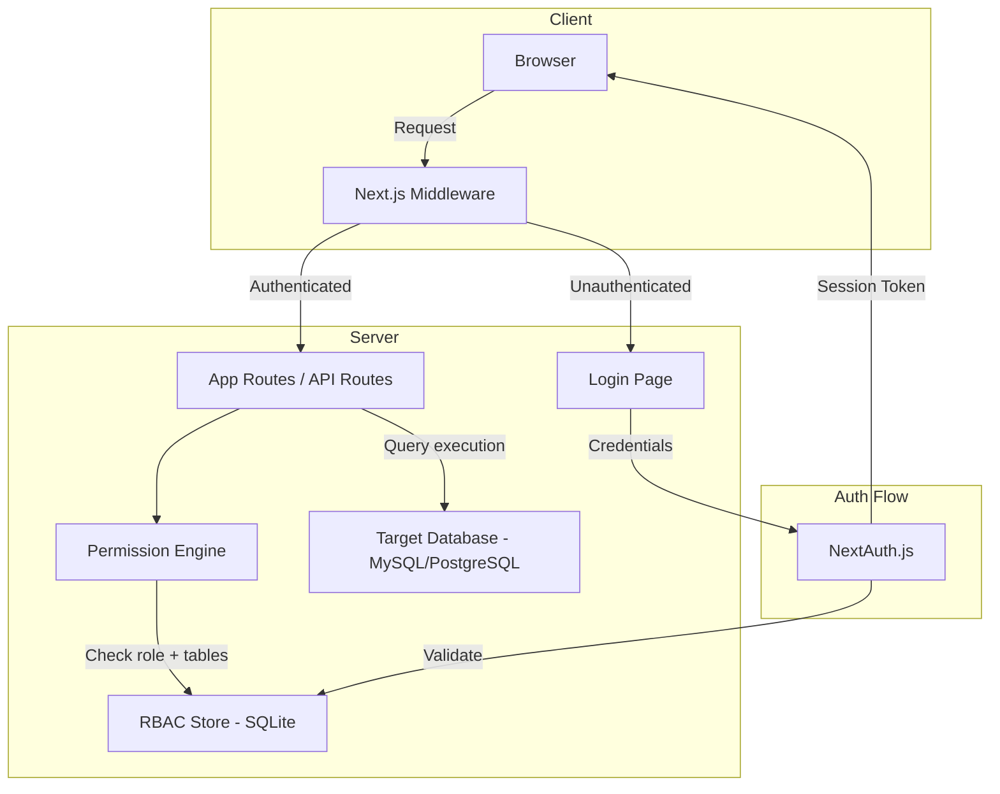

# Design Document: Role-Based Access Control

## Overview

This design introduces a Role-Based Access Control (RBAC) layer to the SQL Query Generator application. The system currently allows unrestricted access to query generation, database connections, and query execution. The RBAC feature adds authentication gating, three fixed roles (viewer, editor, admin), a server-side Permission Engine that enforces table-level and operation-level access, schema visibility filtering, and an admin panel for user management.

The design integrates with the existing Next.js App Router architecture, adding middleware-based authentication, a lightweight SQLite-backed user/role store (via `better-sqlite3`), and a pure-function Permission Engine that can be unit-tested independently of I/O.

### Key Design Decisions

1. **SQLite for user/role storage** — The app already uses direct DB connections for user queries. Adding a separate user management database avoids polluting target databases with RBAC tables. SQLite is zero-config, file-based, and sufficient for the expected user count.
2. **NextAuth.js Credentials provider** — Provides session management, CSRF protection, and HTTP-only cookie tokens out of the box, satisfying Requirement 10 without building custom token infrastructure.
3. **Pure-function Permission Engine** — All permission logic lives in a stateless module (`lib/permissions.ts`) that takes a role, allowed tables, and a SQL statement as input and returns an allow/deny decision. This makes the core logic highly testable via property-based tests.
4. **Middleware for auth gating** — Next.js middleware intercepts all routes except `/login` and public assets, redirecting unauthenticated users before any page or API logic runs.

## Architecture



### Request Flow

1. **Every request** hits Next.js middleware which checks for a valid session token (HTTP-only cookie).
2. **Unauthenticated** → redirect to `/login`.
3. **Authenticated** → request continues to the target route.
4. **API routes** (execute, connect, generate) call the Permission Engine with the user's role and allowed tables.
5. **Permission Engine** parses the SQL (using `node-sql-parser`), extracts referenced tables and operation type, then returns allow/deny.
6. **Schema endpoints** filter visible tables based on the user's allowed tables before returning to the client.

## Components and Interfaces

### 1. Authentication Layer (`lib/auth.ts`)

Uses NextAuth.js with a Credentials provider backed by the SQLite user store.

```typescript
// lib/auth.ts
import NextAuth from "next-auth";
import CredentialsProvider from "next-auth/providers/credentials";
import { verifyUser, getUserByEmail } from "@/lib/rbac/userStore";

export const authOptions = {
  providers: [
    CredentialsProvider({
      name: "credentials",
      credentials: {
        email: { label: "Email", type: "email" },
        password: { label: "Password", type: "password" },
      },
      async authorize(credentials) {
        if (!credentials?.email || !credentials?.password) return null;
        return verifyUser(credentials.email, credentials.password);
      },
    }),
  ],
  session: { strategy: "jwt", maxAge: 24 * 60 * 60 }, // 24h
  callbacks: {
    async jwt({ token, user }) {
      if (user) {
        token.role = user.role;
        token.allowedTables = user.allowedTables;
      }
      return token;
    },
    async session({ session, token }) {
      session.user.role = token.role;
      session.user.allowedTables = token.allowedTables;
      return session;
    },
  },
};
```

### 2. Middleware (`middleware.ts`)

Intercepts all requests, redirecting unauthenticated users to login.

```typescript
// middleware.ts
import { withAuth } from "next-auth/middleware";

export default withAuth({
  pages: { signIn: "/login" },
});

export const config = {
  matcher: ["/((?!login|api/auth|_next/static|_next/image|favicon.ico).*)"],
};
```

### 3. Permission Engine (`lib/permissions.ts`)

A pure-function module — the core of the RBAC enforcement logic.

```typescript
// lib/permissions.ts
export type Role = "viewer" | "editor" | "admin";
export type PermissionResult =
  | { allowed: true }
  | { allowed: false; reason: string };

export interface PermissionContext {
  role: Role;
  allowedTables: string[];
}

/**
 * Checks if a user can execute a given SQL statement.
 * Pure function: no I/O, no side effects.
 */
export function checkQueryPermission(
  sql: string,
  context: PermissionContext
): PermissionResult { ... }

/**
 * Extracts all table names referenced in a SQL statement.
 * Uses node-sql-parser for JOINs, subqueries, CTEs.
 */
export function extractReferencedTables(sql: string): string[] | null { ... }

/**
 * Classifies the SQL operation type from the AST.
 */
export function classifyOperation(sql: string): SQLOperation { ... }

/**
 * Filters a schema to only include allowed tables.
 * Pure function for schema visibility.
 */
export function filterSchema(
  schema: LiveTableInfo[],
  context: PermissionContext
): LiveTableInfo[] { ... }
```

### 4. RBAC Store (`lib/rbac/userStore.ts`)

Manages users, roles, and allowed-tables in SQLite.

```typescript
// lib/rbac/userStore.ts
export interface StoredUser {
  id: string;
  email: string;
  passwordHash: string;
  role: Role;
  allowedTables: string[]; // JSON-serialized in DB
  lockedUntil: number | null;
  failedAttempts: number;
  createdAt: string;
}

export function createUser(email: string, password: string): StoredUser { ... }
export function verifyUser(email: string, password: string): AuthUser | null { ... }
export function getUserByEmail(email: string): StoredUser | null { ... }
export function getAllUsers(): StoredUser[] { ... }
export function updateUserRole(userId: string, role: Role): void { ... }
export function updateAllowedTables(userId: string, tables: string[]): void { ... }
export function countAdmins(): number { ... }
export function recordFailedAttempt(email: string): { locked: boolean } { ... }
export function resetFailedAttempts(email: string): void { ... }
```

### 5. Admin Panel (`app/admin/page.tsx`)

A protected route accessible only to admins. Renders user list, role assignment dropdowns, and table permission editors.

### 6. Login Page (`app/login/page.tsx`)

A public route with email/password form, error messaging, and account lockout display.

### 7. Updated API Routes

Each existing API route (`execute`, `generate`, `connect`) is wrapped with session validation and permission checks:

```typescript
// Pattern for protected API routes
import { getServerSession } from "next-auth";
import { authOptions } from "@/lib/auth";
import { checkQueryPermission } from "@/lib/permissions";

export async function POST(req: NextRequest) {
  const session = await getServerSession(authOptions);
  if (!session) return NextResponse.json({ error: "Unauthorized" }, { status: 401 });
  
  // For execute route: check permissions
  const result = checkQueryPermission(sql, {
    role: session.user.role,
    allowedTables: session.user.allowedTables,
  });
  if (!result.allowed) {
    return NextResponse.json({ error: result.reason }, { status: 403 });
  }
  // ... proceed with execution
}
```

## Data Models

### User Table (SQLite)

| Column | Type | Constraints |
|--------|------|-------------|
| id | TEXT | PRIMARY KEY (UUID) |
| email | TEXT | UNIQUE, NOT NULL, max 254 chars |
| password_hash | TEXT | NOT NULL (bcrypt, cost 10+) |
| role | TEXT | NOT NULL, CHECK(role IN ('viewer','editor','admin')) |
| allowed_tables | TEXT | NOT NULL, DEFAULT '[]' (JSON array) |
| failed_attempts | INTEGER | NOT NULL, DEFAULT 0 |
| locked_until | INTEGER | NULL (Unix timestamp) |
| created_at | TEXT | NOT NULL (ISO 8601) |
| updated_at | TEXT | NOT NULL (ISO 8601) |

### Session Token (JWT via NextAuth)

```typescript
interface JWTPayload {
  sub: string;        // user ID
  email: string;
  role: Role;
  allowedTables: string[];
  iat: number;        // issued at
  exp: number;        // expires at (iat + 86400)
}
```

### Permission Check Input/Output

```typescript
// Input to Permission Engine
interface PermissionCheckInput {
  sql: string;
  role: Role;
  allowedTables: string[];
}

// Output from Permission Engine
type PermissionCheckOutput =
  | { allowed: true }
  | { allowed: false; reason: string };
```

### Role Permission Matrix

| Capability | Viewer | Editor | Admin |
|-----------|--------|--------|-------|
| Generate queries | ✓ | ✓ | ✓ |
| View explanations/impact | ✓ | ✓ | ✓ |
| Connect to database | ✗ | ✓ | ✓ |
| Execute SELECT (allowed tables) | ✗ | ✓ | ✓ |
| Execute SELECT (all tables) | ✗ | ✗ | ✓ |
| Execute INSERT/UPDATE/DELETE | ✗ | ✗ | ✓ |
| Execute DDL (CREATE/DROP/ALTER) | ✗ | ✗ | ✗ |
| View all schema tables | ✗ | ✗ | ✓ |
| Access admin panel | ✗ | ✗ | ✓ |
| Manage users/roles | ✗ | ✗ | ✓ |

## Correctness Properties

*A property is a characteristic or behavior that should hold true across all valid executions of a system — essentially, a formal statement about what the system should do. Properties serve as the bridge between human-readable specifications and machine-verifiable correctness guarantees.*

### Property 1: Operation permission by role

*For any* SQL statement and any user role, the Permission Engine SHALL allow execution if and only if: (a) the role is admin AND the operation is SELECT, INSERT, UPDATE, or DELETE; (b) the role is editor AND the operation is SELECT; (c) DDL operations (CREATE, DROP, ALTER) SHALL be rejected for all roles including admin. Viewer role SHALL reject all execution requests regardless of operation type.

**Validates: Requirements 3.3, 4.2, 5.1, 5.5, 6.3**

### Property 2: Table permission for editor role

*For any* SELECT query and any editor user with a defined Allowed_Tables set, the Permission Engine SHALL allow execution if and only if every table referenced in the query is a member of the user's Allowed_Tables set. When rejected, the error message SHALL contain the name of at least one unauthorized table.

**Validates: Requirements 4.1, 4.3, 6.2**

### Property 3: Schema filtering by role

*For any* database schema (set of tables) and any user context, the `filterSchema` function SHALL return: (a) the complete unmodified schema when the role is admin, (b) exactly the subset of tables whose names appear in the user's Allowed_Tables set when the role is editor or viewer. The output SHALL never contain a table not in the original schema.

**Validates: Requirements 4.4, 5.2, 7.1, 7.2, 7.3, 7.4**

### Property 4: Table extraction completeness

*For any* syntactically valid SQL statement containing table references in FROM clauses, JOIN clauses, subqueries, or Common Table Expressions, the `extractReferencedTables` function SHALL return a set that includes every table name present in the statement.

**Validates: Requirements 6.1**

### Property 5: Unparseable SQL rejection

*For any* string that cannot be parsed as a valid SQL statement, the Permission Engine SHALL reject the execution request (fail-closed). The result SHALL have `allowed: false` with a reason indicating the query could not be validated.

**Validates: Requirements 6.5**

### Property 6: Account lockout threshold

*For any* email address and any sequence of N consecutive failed login attempts, the account SHALL be locked if and only if N >= 5. For N < 5, the account SHALL remain unlocked. After locking, the account SHALL remain locked for 15 minutes regardless of further attempts.

**Validates: Requirements 1.6**

### Property 7: Credential length validation

*For any* email string and password string, the Auth_Service SHALL accept the credentials for processing if and only if the email length is between 1 and 254 characters (inclusive) and the password length is between 8 and 128 characters (inclusive). Credentials outside these bounds SHALL be rejected before any authentication logic runs.

**Validates: Requirements 1.7**

### Property 8: Default role assignment on user creation

*For any* valid user creation request (valid email and password meeting length requirements), the resulting user record SHALL have the role set to "viewer" and the Allowed_Tables set to empty.

**Validates: Requirements 2.2, 8.6**

### Property 9: Non-admin role change rejection

*For any* user with role "viewer" or "editor" attempting to change any user's role or access the admin panel, the RBAC_System SHALL reject the operation with a permission error.

**Validates: Requirements 2.5, 8.5**

### Property 10: Invalid role string rejection

*For any* string that is not exactly "viewer", "editor", or "admin", an attempt to assign that string as a role SHALL be rejected with an invalid-role error.

**Validates: Requirements 2.6**

### Property 11: Admin count invariant

*For any* sequence of role-change operations, the system SHALL maintain at least one user with the admin role. Any operation that would reduce the admin count to zero SHALL be rejected.

**Validates: Requirements 8.3**

### Property 12: Duplicate email rejection

*For any* email address that already exists in the user store, an attempt to create a new user with that same email SHALL be rejected with an error indicating the email is already registered.

**Validates: Requirements 8.7**

### Property 13: Malformed token rejection

*For any* string that is not a validly-signed, non-expired JWT issued by the Auth_Service, authentication SHALL fail and the request SHALL be rejected with an authentication error.

**Validates: Requirements 10.5**

## Error Handling

### Authentication Errors

| Scenario | HTTP Status | Error Code | User Message |
|----------|-------------|------------|--------------|
| No session token | 401 | `AUTH_REQUIRED` | "Please log in to continue." |
| Expired token | 401 | `SESSION_EXPIRED` | "Your session has expired. Please log in again." |
| Malformed token | 401 | `INVALID_TOKEN` | "Authentication failed. Please log in again." |
| Invalid credentials | 401 | `INVALID_CREDENTIALS` | "Invalid email or password." (generic) |
| Account locked | 423 | `ACCOUNT_LOCKED` | "Account temporarily locked. Try again in {minutes} minutes." |

### Authorization Errors

| Scenario | HTTP Status | Error Code | User Message |
|----------|-------------|------------|--------------|
| Viewer executing query | 403 | `ROLE_INSUFFICIENT` | "Your role (viewer) does not permit query execution." |
| Editor executing non-SELECT | 403 | `OPERATION_FORBIDDEN` | "Your role (editor) does not permit {operation} operations." |
| Editor accessing unauthorized table | 403 | `TABLE_UNAUTHORIZED` | "Access denied to table '{tableName}'. Contact your admin." |
| Any role executing DDL | 403 | `DDL_FORBIDDEN` | "DDL operations (CREATE, DROP, ALTER) are not permitted." |
| Non-admin accessing admin panel | 403 | `ADMIN_REQUIRED` | "Admin access required." |
| SQL unparseable for validation | 400 | `QUERY_UNPARSEABLE` | "Could not validate query. Please check SQL syntax." |

### Admin Panel Errors

| Scenario | HTTP Status | Error Code | User Message |
|----------|-------------|------------|--------------|
| Last admin demotion | 409 | `LAST_ADMIN` | "Cannot remove the last admin. Assign another admin first." |
| Duplicate email | 409 | `EMAIL_EXISTS` | "A user with this email already exists." |
| Invalid role assignment | 400 | `INVALID_ROLE` | "Role must be 'viewer', 'editor', or 'admin'." |
| Password too short | 400 | `PASSWORD_TOO_SHORT` | "Password must be at least 8 characters." |

### Error Propagation Strategy

1. **Permission Engine** returns `PermissionResult` objects — never throws.
2. **API routes** catch all errors and return structured JSON responses with appropriate HTTP status codes.
3. **Client components** display error messages from API responses using toast notifications for transient errors and inline messages for persistent errors (e.g., disabled buttons with tooltips).
4. **Middleware** returns redirect responses for auth failures — never exposes stack traces.

## Testing Strategy

### Property-Based Testing

The Permission Engine (`lib/permissions.ts`) is the primary target for property-based testing. It is a pure function with clear inputs (SQL string, role, allowed tables) and outputs (allow/deny decision), making it ideal for PBT.

**Library**: [fast-check](https://github.com/dubzzz/fast-check) — the standard PBT library for TypeScript/JavaScript.

**Configuration**:
- Minimum 100 iterations per property test
- Each test tagged with: `Feature: role-based-access-control, Property {N}: {title}`

**Properties to implement as PBT**:
- Property 1: Operation permission by role
- Property 2: Table permission for editor role
- Property 3: Schema filtering by role
- Property 4: Table extraction completeness
- Property 5: Unparseable SQL rejection
- Property 6: Account lockout threshold
- Property 7: Credential length validation
- Property 8: Default role assignment
- Property 10: Invalid role string rejection
- Property 11: Admin count invariant

**Generator strategy**:
- SQL generators: build ASTs programmatically, then print to SQL (ensures known table references)
- Role generators: `fc.constantFrom("viewer", "editor", "admin")`
- Table set generators: `fc.uniqueArray(fc.string())` for allowed tables
- Credential generators: `fc.string()` with length constraints for boundary testing

### Unit Testing (Example-Based)

- Login/logout flows (Requirements 1.1-1.5)
- UI component rendering by role (Requirement 9)
- Admin panel CRUD operations (Requirement 8.1, 8.2, 8.4)
- Session cookie configuration (Requirement 10.1, 10.2, 10.4)

### Integration Testing

- End-to-end auth flow: login → access protected route → logout → verify rejection
- Permission enforcement via direct API calls (bypassing UI)
- Role change propagation to active sessions
- Database persistence of users and roles across restarts

### Test File Organization

```
__tests__/
  rbac/
    permissions.property.test.ts   # PBT for Properties 1-5
    auth.property.test.ts          # PBT for Properties 6-8, 10-11, 13
    userStore.property.test.ts     # PBT for Properties 8, 11, 12
    permissions.unit.test.ts       # Example-based edge cases
    auth.integration.test.ts       # Login/logout flows
    admin.integration.test.ts      # Admin panel operations
    middleware.integration.test.ts # Route protection
```

